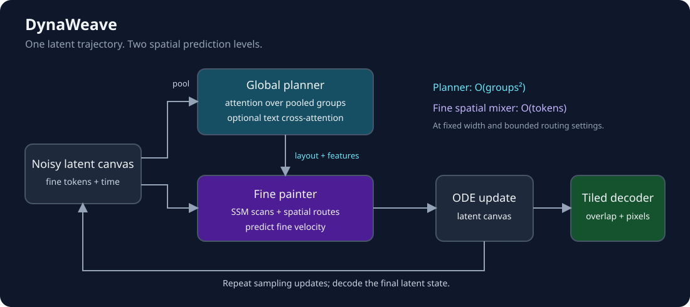
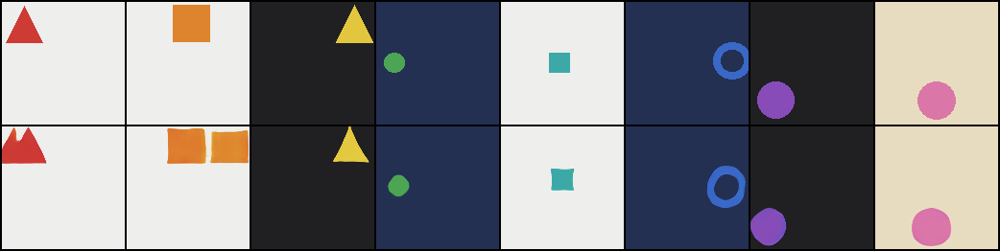
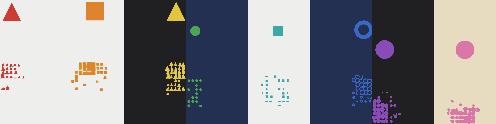

# DynaWeave

**Planner-Guided Image Generation with Dynamically Routed State-Space Models**

DynaWeave is a research implementation of an image generator combining a coarse global
attention planner with a fine state-space painter. This release focuses on
procedural shape experiments: pretrain a tiled autoencoder, freeze it, and
train a caption-conditioned flow model in its latent space.



## Method

The autoencoder processes overlapping image tiles and assembles their latents
into a spatial canvas. During flow training, a global planner predicts coarse
structure from pooled noisy latent tokens. The fine painter uses SSM scans and
spatial routing, conditioned on the predicted layout and planner features, to
estimate fine velocity. Sampling integrates a single latent trajectory.

Fine spatial mixing scales linearly with token count at fixed width and routing
settings. The planner uses quadratic attention over groups; the complete model
is not globally linear. See [architecture details](docs/ARCHITECTURE.md).

## Repository layout

```text
dynaweave/     the model: core layers and scan, the planner/painter flow, text encoding
experiments/   procedural scenes and the two runs reported in the docs
tools/         a small offline dataset writer for the folder-based training path
tests/         CPU checks that run in CI
docs/          architecture notes and the archived experiments
results/       archived measurements from the runs the docs describe
```

Everything is run as a module from the repository root, so nothing depends on a
working directory: `python -m dynaweave.model check`,
`python -m experiments.train_shapes ...`. Runs write to `runs/`, which is
ignored by git.

## Installation

Use Python 3.12 and a recent compatible PyTorch/torchvision pair for your GPU.

```bash
python -m venv .venv
source .venv/bin/activate
python -m pip install -r requirements.txt
python -m dynaweave.model check
python -m unittest discover -s tests -v
```

Development used PyTorch `2.13.0+cu129` and torchvision `0.28.0+cu129`.
These are recorded development builds, not portable installation requirements.
Older releases have not been validated; the experiments use modern compilation
APIs including `torch.compiler.set_stance`. Select a CUDA-compatible installation
for your machine. The captioned experiment requires CUDA and downloads frozen
`openai/clip-vit-large-patch14` text weights on first use.

## Procedural data

[`experiments/shape_scenes.py`](experiments/shape_scenes.py) generates images and matching
captions: five shape types, eight colours, nine positions, two sizes and
multiple backgrounds. No image dataset download is needed. Specified
colour–position pairs can be excluded from training for a compositional probe.

Preview the generator:

```bash
python -m experiments.shape_scenes --size 128 --preview 8
```

## Training

The experiment runs **AE pretraining first**, followed by flow training:

1. Train the randomly initialized tiled AE on procedural scenes for 5,000 updates.
2. Save and freeze the AE, then estimate per-channel latent normalization.
3. Train the caption-conditioned planner/painter in the frozen latent space.

From the repository root:

```bash
python -u -m experiments.train_shapes --name comp \
  --dim 384 --depth 8 --global-depth 6 \
  --image-size 128 --group-size 2 --batch 32 --hold-out \
  --ae-steps 5000 --ae-batch 4 \
  --budget 21600 --eval-every 500 --draw-every 2500 \
  --out runs/holdout.json --preview-dir runs/previews
```

The AE is trained from scratch, not distilled from an external image model.
Only the text encoder is pretrained. If `holdout.ae.pt` already exists, the
script reuses it; choose a new `--out` basename to pretrain a fresh AE.

Outputs:

- `runs/holdout.ae.pt`: pretrained AE weights.
- `runs/holdout.comp.flow.pt`: flow weights and configuration.
- `runs/holdout.json`: training measurements.
- `runs/previews/ae_comp_*.png`: original/reconstruction previews during AE pretraining.
- `runs/previews/capacity_comp_*.png`: reference/generated scene comparisons.

This experiment uses a wall-clock flow-training budget. The archived flow has
62,971,232 parameters and was saved at step 7,000; the command is a reproduction
entry point, not a guarantee of the same stopping step or identical outputs.

## Compositional generalization

Nothing forces a caption-conditioned model to learn *concepts*; it can equally
well memorize caption-to-picture pairs. The procedural generator makes the
difference measurable. Eight `(colour, place)` combinations are withheld from
training entirely — red at the top left, orange at the top, yellow at the top
right, green at the left, teal at the centre, blue at the right, purple at the
bottom left, pink at the bottom — while every colour is still seen in eight
other places and every place with seven other colours. Only the pairing is kept
back. Verified on the stream: zero withheld pairs in 8,009 generated objects,
where 920 would have appeared without the exclusion.

The run is then judged twice: on combinations it trained on, and on the eight it
never saw.

| step | seen | withheld | scenes |
| --- | --- | --- | --- |
| 2,500 | 100% | 88% | 8 |
| 5,000 | 100% | 100% | 8 |
| 7,000 | 100% | 100% | 32 |

Chance is 12.5%. The withheld sheet at step 5,000:



**Top: reference scenes. Bottom: generated samples.** The model places a colour
where it has never been asked to place it, so colour and position are held as
separate, recombinable pieces rather than as a lookup table. Two caveats: the
metric reads a colour out of the named cell and does not check the shape, and
the judged sets are small — eight scenes per in-run row, thirty-two at the end.
The `--hold-out` flag in the training command above is what sets this up; see
[experiments](docs/EXPERIMENTS.md) for the withheld list and what the sheets
show that the score does not.

## Resolution extrapolation, and what the two levels do with it

A model trained at 128×128 can be sampled directly at 512×512, and the result is
the most interesting thing in this repository. It is not a clean success and it
is not noise:



**Top: reference scenes. Bottom: generated samples.** The planner extrapolates:
each region carries the colour the caption asked for, in the place it asked for,
at roughly the extent it should occupy. The painter cannot follow it there. It
has only ever been shown shapes a few tokens across, so when the plan says *this
whole area is a red triangle* it renders what it knows — red triangles, at the
only size it has ever drawn, packed across the region.

The swarm is made of the **correct shape**: triangles beget triangles, squares
beget squares, rings beget rings. The painter never reads the caption as a
sequence — it receives one pooled vector for the whole image — so shape identity
must be travelling down through the plan, and is being reinterpreted at the only
scale the painter has. Correct information, wrong register.

These are direct 512px samples, not enlarged 128px images. GitHub scales the
contact sheet for display.

Run the probe after training, from the repository root:

```bash
python -u -m experiments.canvas_scaling \
  --probe runs/holdout.comp.flow.pt --ae runs/holdout.ae.pt \
  --train-canvas 128 --sizes 128 512 \
  --name probe --out runs/canvas_probe.json --preview-dir runs/previews
```

The probe compares position interpolation with coordinate extension. See
[experiments](docs/EXPERIMENTS.md) for the native-resolution baseline, both 512px
modes and metric limitations.

## Video — coming soon

The planned video workflow extends the same hierarchy into space and time.
Frames are represented as latent grids; spatiotemporal token groups provide
the planner with coarse scene and motion context. A fine painter mixes spatial
and temporal information to predict velocities over the latent clip, which is
integrated as one flow trajectory and decoded back into frames.

An internal 3-D prototype exists, but its training and evaluation workflow is
not included in this release. Temporal consistency, longer-clip generation,
and scaling to real video remain to be evaluated.

## Where this stands

This is active research, published as it goes rather than as a finished
product. What is here has been built and measured: a procedural generator whose
captions are exact by construction, a two-level flow that turns out to hold
colour and position as separable concepts, and a resolution probe whose result
is worth reading precisely because it is partial. What is not here is a
pretrained image generator. No weights are bundled, and none of these numbers
are benchmarks.

The boundaries, stated plainly:

- The colour diagnostic reads a palette colour out of a named cell. It says
  nothing about geometry, object count or overall quality, which is why every
  score in the docs is printed next to the picture it came from.
- Archived results predate some fixes in the current source. The repository
  reproduces the experiments; it does not reconstruct those exact runs.
- Everything measured so far is drawn shapes. Photographs, texture and scraped
  captions are a different problem, and nothing here shows the architecture
  survives the move.
- No claim of state of the art, or of established architectural novelty, is
  made.

Work is ongoing: training the painter across several canvas sizes so it can
render a plan at a scale it never saw, extending the same hierarchy into video,
and taking the whole thing off synthetic data. The repository will keep moving,
and the open questions above are the reason it exists rather than an apology
for it.

Licensed under [Apache 2.0](LICENSE).
