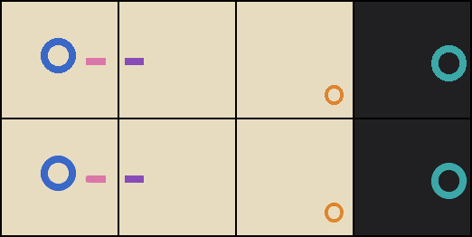
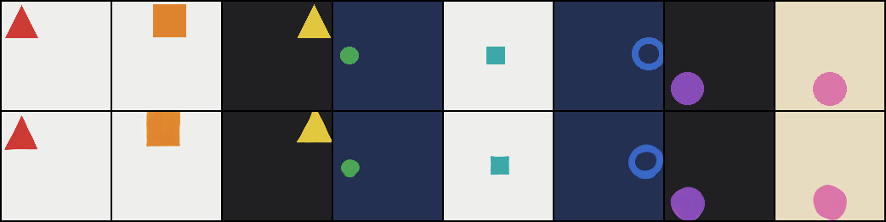
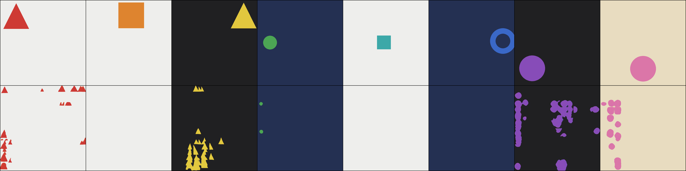

# Archived shapes experiments

These are historical artifacts copied from the working experiments, not new runs
performed for publication. Every figure below is an unedited contact sheet
written by the experiment scripts themselves, not an illustration drawn for the
write-up; the only diagram made for this documentation is
[`architecture.svg`](assets/architecture.svg), which explains the model rather
than measuring it. `results/holdout.json` and `results/canvas.json` keep the
original values; only their field names were translated, so an archived file and
a fresh one can be read side by side.

## 128px held-out colour/place combinations

The archived `comp` flow has 62,971,232 parameters, batch 32, and a final recorded
step of 7,000. Eight `(colour, place)` pairs were removed from the training
stream — one per colour, spread over the grid — so that each colour was still
seen in the eight other places and each place with the seven other colours, and
only the pairing was withheld. The exclusion was checked on the generator before
the run: zero withheld pairs in 8,009 objects, against 920 that the same seed
produced without it.

| step | seen | withheld | scenes judged |
| --- | --- | --- | --- |
| 2,500 | 100% | 88% (7/8) | 8 |
| 5,000 | 100% | 100% (8/8) | 8 |
| 7,000 | 100% | 100% (32/32) | 32 |

Chance is 12.5%. The in-run rows are the preview sheets, eight scenes each; the
last row is the end-of-run judge on `--judge-count` scenes. Both arms are judged
by the same metric, which is the point of carrying the seen column: a withheld
score means something only next to the score on combinations that were trained.

Top: reference scenes. Bottom: generated samples. This sheet is from step 5,000,
not the step-7,000 checkpoint used by the canvas probe. Inspecting it by eye,
the shapes and sizes are right as well as the colours, on combinations the model
was never trained on — but two of the eight panels draw the object twice, which
the metric does not see and which does not appear on the seen arm. Whatever
transfers, it transfers with less certainty than the score suggests.

The local AE cache reported 41.8 dB PSNR in the original run log. That is a
synthetic reconstruction observation, not a photo-reconstruction benchmark.

## Resolution extrapolation: what each level does with a bigger canvas

The saved probe log identified a step-7,000 checkpoint trained on a 128px canvas
and 128px painter window: 64 fine tokens and four groups per spatial side.
It evaluated direct generation at 128, 256, 512, 1024 and 2048px.

| canvas | factor | stretched | extended |
| --- | --- | --- | --- |
| 128px | 1x | 100% | 100% |
| 256px | 2x | 75% | 38% |
| 512px | 4x | 88% | 50% |
| 1024px | 8x | 75% | 75% |
| 2048px | 16x | 50% | 50% |

The scores stay well above the 12.5% chance line at every size, which says the
planner keeps placing the right colour in the right region far outside the
canvas it was fitted on. What the scores cannot say is what the picture is made
of, and that is the interesting part: the painter has only ever been shown
shapes a few tokens across, so a plan that reads *this region is a red triangle*
comes out as a field of small red triangles rather than one large one. The
identity survives the trip down from the planner — triangles stay triangles,
rings stay rings — and is re-rendered at the only scale the painter owns. The
painter never sees the caption as a sequence, only a single pooled vector, so
that identity has to be arriving through the plan itself.

Native 128px sampling, with position interpolation enabled:

Direct 512px sampling, with position interpolation enabled (`stretched`):

Direct 512px sampling, extending coordinates without interpolation (`extended`):

Every sheet shows references above generated outputs. “Stretched” refers to
position interpolation inside sampling, not resizing a generated raster. The
images are saved contact sheets and are unedited apart from ASCII filenames.

The diagnostic detects a palette colour using the pixel most different from the
estimated background in the named spatial cell. It does **not** verify the
requested shape, single-object count, full geometry, or absence of extra
objects. A field of tiny triangles therefore scores as a correct red triangle,
which is exactly why the sheets are printed next to the numbers: at these sizes
the pictures carry the finding and the score only carries the placement.

The probe did not pair identical initial noise across both sampling modes;
these sheets are illustrative comparisons, not a controlled same-noise ablation.
The archived `canvas.json` also includes distinct `window` and `mix` training
experiments. Those are not the 128px-only checkpoint and should not be conflated
with its resolution probe.

## Reproduction boundaries

The README provides commands to train a new checkpoint and run the probe.
Weights are excluded from this repository, so the archive cannot be regenerated
bit-for-bit from the repository alone. Historical cached AEs and checkpoints
were local artifacts. Subsequent fixes include route initialization symmetry,
channel-wise latent normalization in the canvas trainer, and FP32 KL reduction
under AMP. Current source should be treated as a versioned continuation, not
as an exact reconstruction of the historical execution environment.
